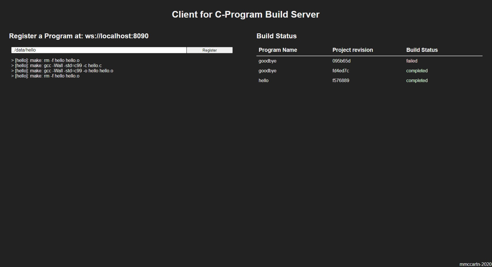

Build Runner GUI
================
Single page website for registering programs and viewing the status of builds.

Requirements
------------
 * [NodeJS](https://nodejs.org/) 10+

Installation
------------
`npm install`

Development
-----------
1. Compile and host locally: `npm run dev`
2. Navigate to GUI at: [http://localhost:8080/](http://localhost:8080/)

Deploy
------
`npm run build` the site to `./public`

Configure
---------
The server address is set to `ws://localhost:8090` by default. To alter, set the
`BUILD_SERVER_URL` environment variable to the appropriate value before running
either the `dev` or `build` package scripts.

For example:
```bash
BUILD_SERVER_URL=ws://foo.bar.net bash -c 'npm run dev'
```

Example
-------

